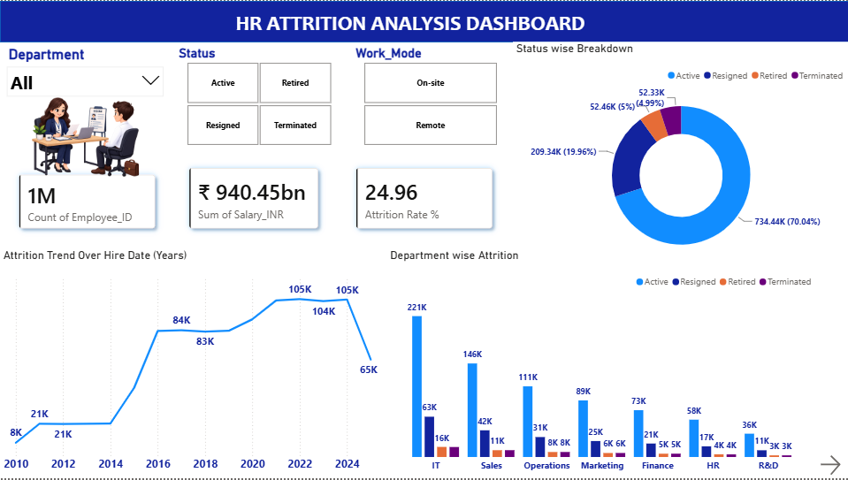
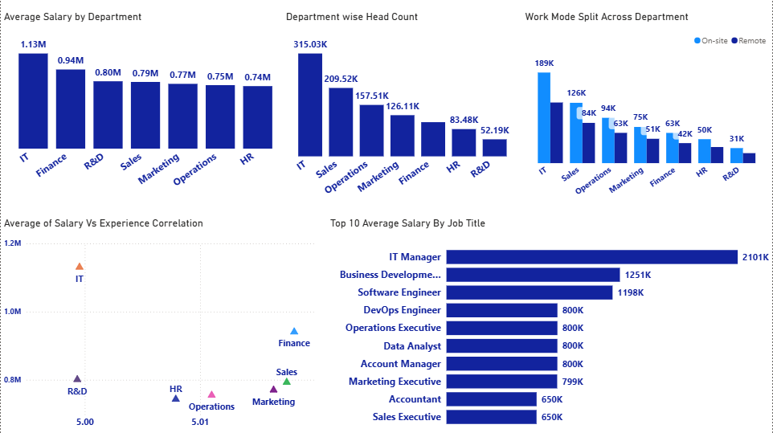

# HR Attrition Analysis Dashboard

An interactive Power BI dashboard analyzing employee attrition, salary, and workforce trends using an HR dataset of 1M+ employee records.

---

## 📌 Project Overview

This project explores employee attrition patterns across departments, job roles, and hiring years to answer key HR questions:
- Which departments have the highest attrition?
- How does salary vary by department and job title?
- Is there a relationship between experience and salary?
- What's the split between on-site and remote employees?

---

## 📊 Dataset

- **Source:** Kaggle — HR Data (1M+ employee records)
- **Size:** 1,048,575 rows
- **Columns:** Employee_ID, Full_Name, Department, Job_Title, Hire_Date, City, Country, Performance_Rating, Experience_Years, Status, Work_Mode, Salary_INR

---

## 🛠️ Tools & Skills Used

- **Power BI Desktop** — dashboard design and visualization
- **Power Query** — data cleaning (splitting Location into City/Country, removing duplicates)
- **DAX** — custom measures for attrition rate and performance metrics
- **Data Modeling** — table structure and field formatting

---

## 🔑 Key DAX Measures

```dax
Total Employees = COUNT(HR_Data[Employee_ID])

Attrition Count = CALCULATE([Total Employees], HR_Data[Status] IN {"Resigned","Terminated"})

Attrition Rate % = DIVIDE([Attrition Count], [Total Employees]) * 100
```

**Note on Attrition Rate definition:** Attrition is calculated using only **Resigned + Terminated** employees, deliberately excluding **Active** (still employed) and **Retired** (natural, planned exit) employees. This keeps the metric focused on unplanned/involuntary workforce loss, which is what attrition is meant to measure.

---

## 📈 Dashboard Pages

### Page 1 — Attrition Overview
- KPI Cards: Total Employees, Total Salary, Attrition Rate %
- Status-wise breakdown (Active/Resigned/Retired/Terminated)
- Department-wise attrition (stacked bar)
- Hiring trend by year (2010–2025)
- Slicers: Department, Status, Work_Mode



### Page 2 — Salary, Performance & Workforce
- Average Salary by Department
- Top 10 Average Salary by Job Title
- Salary vs Experience correlation (scatter plot)
- Work Mode split by department
- Department-wise headcount



---

## 💡 Key Insights

- Overall attrition rate: **24.96%**
- IT department has the highest average salary among all departments
- Performance ratings are fairly consistent across departments (no major outliers)

---

## 📝 Note on Project Files

The full Power BI (.pbix) file isn't included in this repo due to its large size (dataset has 1M+ rows). The screenshots above show the complete, working dashboard.

---

## 🙋 About Me

Learning Data Analytics through hands-on projects. Currently building my portfolio in Excel and Power BI, and actively looking for entry-level opportunities in Data Analytics / Business Intelligence.

**Connect with me:** [https://www.linkedin.com/in/nasrath-banu-a-016b952b4]
