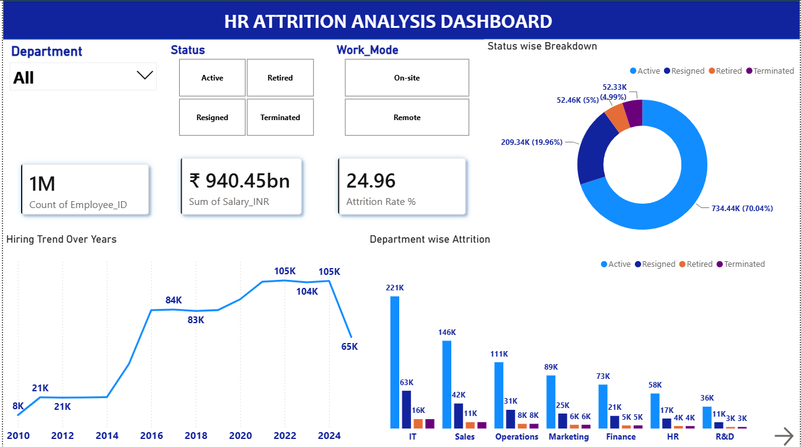
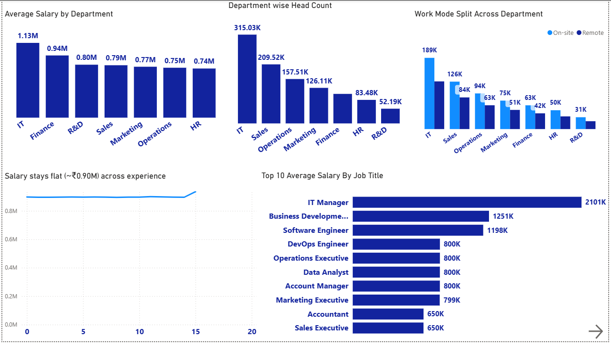
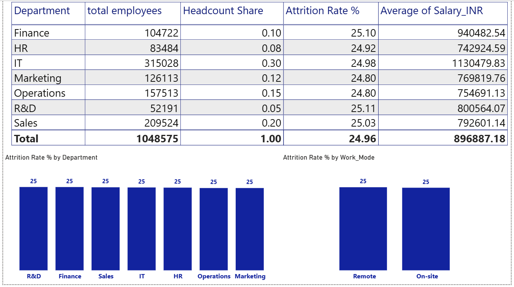

# HR Attrition Analysis Dashboard

**Power BI | DAX | Power Query | 1M+ employee records**

An interactive 3-page Power BI dashboard that quantifies workforce attrition across **1,048,575 employee records** and shows HR leaders where retention effort will, and will not, pay off.

---

## 📌 Executive Summary

Analyzed attrition, salary and workforce patterns across 7 departments and 2 work modes. Headline findings:

- **24.96% attrition** (about 262K exits). **~80% of exits are voluntary resignations**; only 4.99% are terminations.
- Attrition is **flat at ~25% in every department and in both work modes**, so the problem is company-wide, not tied to one team or to remote work.
- **IT is 30% of headcount but ~38% of total salary cost**, making IT exits the most expensive to absorb.
- **Salary does not grow with experience** (about ₹0.90M at 0 years and at 14 years), which is a testable retention lever.

---

## 🎯 Business Problem

HR leadership needs clear answers to four questions before committing a retention budget:

1. Which departments lose the most people?
2. Is remote work a retention risk?
3. Does pay progress with experience?
4. Where is salary cost concentrated?

---

## 📊 Dataset

- **Source:** [Kaggle - HR Data MNC](https://www.kaggle.com/datasets/rohitgrewal/hr-data-mnc)
- **Size:** 1,048,575 rows x 12 analytical columns (plus a serial-number index)
- **Columns:** Employee_ID, Full_Name, Department, Job_Title, Hire_Date, City, Country, Performance_Rating, Experience_Years, Status, Work_Mode, Salary_INR
- **Hire dates:** 2010 to 2025
- **Note:** This is a public, synthetic dataset (names and locations are randomly generated), used to demonstrate the analysis workflow. No location-based conclusions were drawn.

---

## 🛠️ Tools & Pipeline

| Stage | What was done |
|---|---|
| **Data preparation (Power Query)** | Standardized data types, removed duplicates, split Location into City and Country, dropped the index column |
| **Data modeling (DAX)** | Engineered attrition, headcount-share and salary measures (see below) |
| **Dashboard design (Power BI)** | Built a 3-page interactive report with Department, Status and Work_Mode slicers |

---

## 🔑 Key DAX Measures

```DAX
Total Employees = COUNT(HR_Data[Employee_ID])

Attrition Count = CALCULATE([Total Employees], HR_Data[Status] IN {"Resigned","Terminated"})

Attrition Rate % = DIVIDE([Attrition Count], [Total Employees]) * 100

Headcount Share % = DIVIDE([Total Employees], CALCULATE([Total Employees], ALL(HR_Data[Department])))
```

**Attrition definition:** Attrition counts only **Resigned + Terminated** employees. **Active** (still employed) and **Retired** (natural, planned exit) are excluded, keeping the metric focused on unplanned workforce loss.

---

## 📈 Dashboard Pages

### Page 1 - Attrition Overview
- KPI cards: Total Employees, Total Salary, Attrition Rate %
- Status breakdown (Active / Resigned / Retired / Terminated)
- Hiring trend by year and department-wise status breakdown
- Slicers: Department, Status, Work_Mode



### Page 2 - Salary, Performance & Workforce
- Average salary and headcount by department
- Work mode split by department
- Average salary by years of experience
- Top 10 average salary by job title



### Page 3 - Attrition Deep Dive
- Department summary table: headcount, headcount share, attrition rate, average salary
- Attrition rate by department and by work mode



---

## 💡 Key Insights

1. **Overall attrition is 24.96%.** Of 1,048,575 employees, 70.04% are Active (734.44K), 19.96% Resigned (209.34K), 5.00% Retired (52.46K) and 4.99% Terminated (52.33K).
2. **Exits are mostly voluntary.** Resignations make up ~80% of all attrition, about 4x the number of terminations.
3. **Attrition is uniform across departments.** All 7 departments sit at roughly 25%, so no single team explains the problem.
4. **Work mode makes no difference.** On-site attrition is 24.89% (628K employees) vs 25.05% for remote (420K employees), a gap of 0.16 points. Average salary is also the same (~₹0.90M) in both.
5. **IT concentrates cost.** IT holds 30% of headcount (315,028 employees) and the highest average salary (₹1.13M, 26% above the company average of ₹0.90M and ~1.5x HR at ₹0.74M). That translates to ~38% of total salary spend.
6. **Pay is driven by job title, not tenure.** Average salary stays ≈₹0.90M from 0 to 14 years of experience (₹0.94M at 15 years). IT Manager leads at ₹2.10M, followed by Business Development (₹1.25M) and Software Engineer (₹1.20M); Accountant and Sales Executive sit at ₹0.65M.
7. **Hiring scaled sharply.** Hires grew from ~21K per year (2011-2014) to ~84K by 2016 and ~105K per year across 2021-2024. 2025 shows 65K, likely a partial year.

---

## ✅ Recommendations

1. **Treat retention as a company-wide program.** With ~25% attrition in every department and both work modes, department-specific or remote-work policy changes are unlikely to move the number. Start with structured exit interviews, stay interviews and an engagement survey to capture drivers this dataset does not contain.
2. **Focus on voluntary exits.** Since ~80% of exits are resignations, prioritize compensation, career growth and manager quality over performance-management measures (terminations are only 4.99%).
3. **Review tenure-based pay progression.** Flat pay from 0 to 14 years may push experienced staff to leave. Benchmark against market rates, introduce experience-linked pay bands, and track whether resignations fall.
4. **Target high-cost roles first.** IT carries ~38% of salary spend, and senior titles such as IT Manager average ₹2.10M. Concentrate retention budget and succession planning on these roles, where each exit costs the most to replace.

---

## 📁 Project Files

| File | Description |
|---|---|
| `README.md` | Project documentation |
| `images` | Dashboard screenshots (3 pages) |

The `pbix` file is not supported because of large size. I uploaded the Screenshots of the Dashboard

---

## 🙋 Work With Me

I build **Power BI dashboards, Excel reporting and data cleaning pipelines** that turn raw data into decisions. Open to freelance projects and full-time roles.

- Dashboard design and DAX modeling (Power BI)
- Excel analysis, pivot reporting and automation
- Data cleaning and analysis with Python and SQL

**Contact:** ` nasrathbanu30@gmail.com` | `<Upwork / Fiverr profile link>` | [LinkedIn](https://www.linkedin.com/in/nasrath-banu-a-016b952b4)
